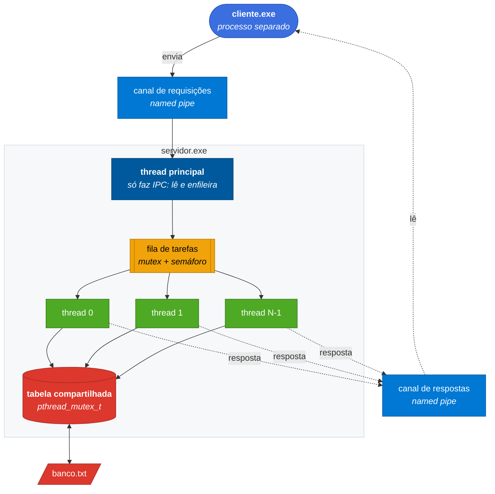
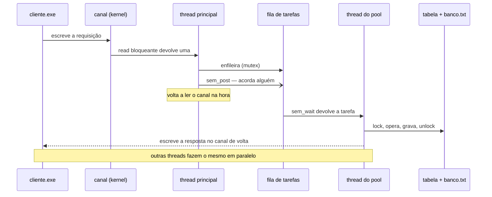

<div align="center">

# Processamento Paralelo de Requisições a um Banco de Dados

**Dois processos, um canal do kernel e um pool de threads disputando a mesma tabela.**

Simulação do núcleo de um SGBD: um processo cliente envia requisições por IPC,
um processo servidor as distribui entre várias threads, e a tabela
compartilhada é protegida por exclusão mútua.

[](https://en.cppreference.com/w/cpp/17)
[](https://man7.org/linux/man-pages/man7/pthreads.7.html)
[](https://learn.microsoft.com/windows/win32/ipc/named-pipes)
[](#decisões-técnicas)
[](#rodando)

[O problema](#o-problema) · [Arquitetura](#arquitetura) · [Rodando](#rodando) · [Decisões técnicas](#decisões-técnicas) · [Mapa dos requisitos](#mapa-dos-requisitos)

</div>

---

Avaliação M1 de **Sistemas Operacionais** (UNIVALI) — IPC, Threads e
Paralelismo. Enunciado completo em [`docs/`](docs/).

Saída real do modo paralelo, com quatro threads:

```
-> #1   INSERT id=10 nome='Carlos Lima'          <- #1   [thread 0] OK inserido id=10
-> #2   INSERT id=11 nome='Beatriz Rocha'        <- #2   [thread 3] OK inserido id=11
-> #3   INSERT id=12 nome='Diego Alves'          <- #6   [thread 3] ERRO id 12 nao encontrado
-> #4   SELECT nome WHERE id=11                  <- #7   [thread 3] OK 0 registros para id=12
-> #5   SELECT nome WHERE id=99                  <- #8   [thread 3] OK removido id=10
-> #6   UPDATE id=12 nome='Diego Alves Junior'   <- #9   [thread 3] ERRO id 1 ja existe
-> #7   SELECT nome WHERE id=12                  <- #4   [thread 2] OK id=11 nome='Beatriz Rocha'
-> #8   DELETE WHERE id=10                       <- #5   [thread 0] OK 0 registros para id=99
                                                 <- #3   [thread 1] OK inserido id=12
```

As respostas **não voltam na ordem em que foram enviadas** e cada uma traz a
thread que a atendeu. Não é bug: é a prova de que quatro threads estão
trabalhando ao mesmo tempo sobre a mesma tabela.

Repare no `#6`: o `UPDATE id=12` falhou porque a thread que o pegou chegou
antes de a thread 1 terminar o `INSERT id=12` do `#3`. **Processar em paralelo
significa abrir mão da ordem** — por isso o modo paralelo é opcional, e o modo
padrão do cliente é sequencial.

## O problema

O enunciado pede um sistema onde dois processos conversam e várias threads
disputam a mesma estrutura de dados. Cada uma dessas exigências traz um
problema clássico de sistemas operacionais junto:

|   | Problema | Como está resolvido aqui |
|---|---|---|
| **1** | Dois processos não enxergam a memória um do outro | Canal nomeado do kernel (`CreateNamedPipe`), o equivalente do FIFO POSIX |
| **2** | Uma requisição lenta travaria a leitura do canal | A thread principal só enfileira; quem processa é o pool |
| **3** | Várias threads no mesmo vetor corrompem os dados | Seção crítica com `pthread_mutex_t` |
| **4** | Thread parada não sabe quando chegou trabalho | Semáforo `sem_t` contando tarefas na fila |
| **5** | Duas threads escrevendo no canal intercalariam respostas | Mutex próprio do canal de respostas |

Os itens 3 a 5 são invisíveis quando dá tudo certo — e é justamente aí que mora
a dificuldade. Uma condição de corrida não falha toda vez; ela falha na
demonstração.

## Arquitetura



O caminho de uma requisição, do envio à resposta:



> [!NOTE]
> A thread principal nunca toca na tabela. Ela lê do canal, enfileira e volta a
> ler — nada mais. É o que garante que o canal de requisições seja drenado
> continuamente, mesmo com todas as threads do pool ocupadas.

## Rodando

Pré-requisito: **MinGW-w64** (`g++` com suporte a pthreads) no PATH.

```bat
git clone https://github.com/naasdd/trabalho-m1-SO.git
cd trabalho-m1-SO
mingw32-make
```

Em um terminal, suba o servidor — o argumento é o tamanho do pool (padrão 4):

```bat
servidor.exe 4
```

Em **outro** terminal, rode o cliente:

```bat
cliente.exe "INSERT id=9 nome='Ana'"   :: um único comando
cliente.exe demo.txt                   :: um arquivo, uma linha por comando
cliente.exe demo.txt --paralelo        :: envia tudo de uma vez (ver abaixo)
cliente.exe                            :: lê do teclado, Ctrl+Z e Enter para terminar
```

O servidor encerra sozinho quando o cliente desconecta e imprime quantas
requisições cada thread atendeu.

### Comandos aceitos

```sql
INSERT id=7 nome='Joao'
SELECT nome WHERE id=7        -- ou SELECT id=7
UPDATE id=7 nome='Joana'
DELETE WHERE id=7             -- ou DELETE id=7
LISTAR
```

### Roteiro de demonstração

Salve como `demo.txt` — exercita as quatro operações e os casos de erro. O
banco já sobe com os ids 1, 2 e 3 vindos do `banco.txt`, então o roteiro
trabalha a partir do 10:

```sql
INSERT id=10 nome='Carlos Lima'
INSERT id=11 nome='Beatriz Rocha'
INSERT id=12 nome='Diego Alves'
SELECT nome WHERE id=11
SELECT nome WHERE id=99
UPDATE id=12 nome='Diego Alves Junior'
SELECT nome WHERE id=12
DELETE WHERE id=10
INSERT id=1 nome='Duplicado'
UPDATE id=77 nome='Inexistente'
BUSCAR tudo
LISTAR
```

### Os dois modos do cliente

| Modo | Comportamento | Para que serve |
|---|---|---|
| **sequencial** (padrão) | Envia um comando, espera a resposta, envia o próximo | Demonstrar o CRUD. A saída é determinística e legível |
| **`--paralelo`** | Envia tudo de uma vez e só depois recolhe as respostas | Demonstrar o pool. As respostas voltam fora de ordem |

Mesmo no modo sequencial as requisições são distribuídas entre as threads do
pool — o resumo do servidor mostra isso. O que muda é quantas tarefas existem
na fila ao mesmo tempo.

Para acentuar o contraste, rode o modo paralelo com uma thread só:

```bat
servidor.exe 1
```

Com uma única thread, as respostas voltam sempre na ordem — porque não há mais
concorrência nenhuma para embaralhá-las.

Depois abra o `banco.txt`: ele foi reescrito pelas threads durante a execução e
guarda o estado final da tabela.

## Decisões técnicas

<details open>
<summary><b>O modo paralelo envia tudo antes de ler qualquer resposta</b></summary>

Um cliente que envia uma requisição e espera a resposta antes da próxima nunca
daria mais de uma tarefa por vez ao servidor. O pool existiria no código, mas
ficaria com uma thread trabalhando e as outras paradas — o paralelismo seria
uma afirmação no relatório, não um comportamento observável.

Enviando o lote inteiro primeiro, o servidor acumula requisições na fila e as
threads competem por elas. É por isso que as respostas voltam fora de ordem, e é
por isso que cada resposta carrega o número da requisição: sem ele não daria
para saber a que pergunta cada resposta corresponde.

O preço é não haver garantia de ordem entre requisições — um `UPDATE` pode ser
executado antes do `INSERT` que o precedia. Um banco real resolve isso com
transações e travas por registro; aqui a solução é mais simples e honesta:
quando a ordem importa, use o modo sequencial.

</details>

<details>
<summary><b>A fila de tarefas não tem limite de tamanho</b></summary>

Parece descuido, mas é o contrário: uma fila limitada abriria espaço para um
impasse entre os dois processos.

No modo paralelo o cliente escreve todas as requisições antes de ler as
respostas. Se o canal de respostas encher, as threads do pool ficam bloqueadas
escrevendo nele. Com uma fila limitada, a thread principal também travaria ao
tentar enfileirar, e pararia de drenar o canal de requisições — que encheria e
travaria o cliente, que por sua vez nunca chegaria a ler as respostas que
destravariam as threads. Impasse em quatro pontas.

Com a fila sempre aceitando, a thread principal nunca para de drenar o canal de
requisições. O cliente termina de enviar, começa a ler, e as threads destravam.

</details>

<details>
<summary><b>Três recursos compartilhados, três seções críticas</b></summary>

| Recurso | Proteção | Por quê |
|---|---|---|
| A tabela e o `banco.txt` | `mutex_tabela` | Duas threads inserindo ao mesmo tempo corromperiam o vetor; duas reescrevendo o arquivo o deixariam pela metade |
| A fila de tarefas | `mutex_fila` + `sem_itens` | O mutex protege a fila; o semáforo conta quantas tarefas existem |
| O canal de respostas | `mutex_resposta` | Um canal é uma corrente de bytes: duas threads escrevendo juntas entregariam duas respostas intercaladas |

Os mutexes são separados de propósito. Se o canal de respostas usasse o mesmo
mutex da tabela, uma thread escrevendo a resposta bloquearia outra que só queria
fazer um `SELECT` — o paralelismo cairia sem nenhuma necessidade.

</details>

<details>
<summary><b>A gravação do arquivo acontece dentro da seção crítica</b></summary>

O `banco.txt` é reescrito a cada `INSERT`, `UPDATE` ou `DELETE`, e essa gravação
fica **dentro** do `lock`/`unlock` da tabela, não depois.

O arquivo é tão compartilhado quanto o vetor. Se a gravação ficasse fora da
seção crítica, duas threads poderiam reescrevê-lo ao mesmo tempo e o resultado
seria um arquivo truncado ou com linhas misturadas. Manter as duas escritas —
memória e disco — na mesma seção crítica garante que o arquivo sempre reflita um
estado consistente da tabela.

</details>

<details>
<summary><b>O encerramento das threads usa um <code>sem_post</code> por thread</b></summary>

Um semáforo não tem o equivalente ao *broadcast* de uma variável de condição:
cada `sem_post` acorda exatamente uma thread. Como as threads do pool ficam
bloqueadas em `sem_wait` esperando trabalho, encerrar o servidor exige liberar o
semáforo uma vez para cada thread.

Quem acorda e encontra a fila vazia entende que aquilo era o sinal de parada e
sai do laço. Quem acorda e ainda encontra trabalho enfileirado processa
normalmente — nenhuma requisição é descartada no encerramento.

</details>

<details>
<summary><b>Quem cria o canal fica com a ponta de leitura</b></summary>

São dois canais, cada um criado por um lado diferente: o servidor cria o de
requisições, o cliente cria o de respostas. A regra é sempre a mesma — quem cria
lê, quem abre escreve.

Isso resolve a ordem de subida. O cliente cria o canal de respostas **antes** de
abrir o de requisições, porque o servidor vai tentar abrir o de respostas assim
que aceitar a conexão. Invertendo a ordem, o servidor bateria num canal que
ainda não existe.

</details>

<details>
<summary><b>Por que o IPC mora dentro de <code>banco.h</code></b></summary>

`banco.h` está dividido em duas partes: o canal de IPC e o banco propriamente
dito. Elas ficam no mesmo arquivo porque cliente e servidor precisam combinar
exatamente o mesmo formato de mensagem. Se cada um tivesse a sua cópia da
`struct Mensagem` e uma delas mudasse, os dois processos passariam a interpretar
os mesmos bytes de maneiras diferentes — e o erro só apareceria em tempo de
execução, como dado corrompido.

</details>

## Mapa dos requisitos

Cada exigência do enunciado e o ponto do código que a atende:

| Requisito | Onde está |
|---|---|
| Cliente e servidor são **executáveis distintos**, processos de SO separados | `cliente.cpp` e `servidor.cpp` → dois `.exe` |
| Comunicação por **IPC real** (canal nomeado), não variável global nem arquivo em polling | `criarCanal` / `abrirCanal` em `banco.h` |
| Respostas por um **segundo canal** de IPC | `CANAL_RESPOSTAS` em `banco.h` |
| Servidor com **pool de threads** processando em paralelo | `trabalhador()` + `pthread_create` em `servidor.cpp` |
| Fila **produtor/consumidor** entre a leitura e o pool | `fila` + `mutex_fila` + `sem_itens` em `servidor.cpp` |
| Tabela compartilhada protegida por **mutex real** | `mutex_tabela` (`pthread_mutex_t`) em `banco.h` |
| **INSERT, SELECT, UPDATE, DELETE** por id | `executarComando()` em `banco.h` |
| Banco simulado em **vetor ou arquivo** | `tabela` (`std::vector`) persistida em `banco.txt` |

## Estrutura

O projeto inteiro são cinco arquivos:

| Arquivo | Papel |
|---|---|
| `servidor.cpp` | Pool de threads, fila de tarefas e laço de IPC |
| `cliente.cpp` | Envia as requisições e recolhe as respostas |
| `banco.h` | Parte 1: formato da mensagem e canal de IPC. Parte 2: tabela, mutex, operações e persistência |
| `banco.txt` | O banco em disco, no formato `id;nome` |
| `makefile` | Compilação dos dois executáveis |

`banco.h` é um cabeçalho com implementação embutida (`inline`). Para um projeto
deste tamanho, separá-lo em `.h` + `.cpp` dobraria o número de arquivos sem
mudar nada na compilação.

## Limitações conhecidas

Escolhas conscientes, não pendências esquecidas:

- **Sem garantia de ordem no modo paralelo.** Requisições enviadas em sequência
  podem ser executadas fora de ordem. É o custo do paralelismo, e o modo
  sequencial existe justamente para quando a ordem importa.
- **Um cliente por vez.** Uma instância de named pipe atende uma conexão; o
  servidor encerra quando o cliente desconecta. O paralelismo demonstrado é o do
  pool de threads, que é o que o enunciado pede.
- **Só Windows.** A camada de IPC usa named pipes. Portar para Linux é trocar
  `criarCanal`, `abrirCanal`, `lerMensagem` e `escreverMensagem` por
  `mkfifo`/`open`/`read`/`write` — está tudo isolado na Parte 1 do `banco.h`.
- **Busca linear na tabela.** `procurar()` percorre o vetor. Um índice seria
  mais rápido, mas esconderia a seção crítica atrás de uma estrutura mais
  complicada, que não é o assunto do trabalho.
- **Sem transações.** Cada comando é atômico em si, mas não há como agrupar
  vários em uma unidade que falhe ou tenha sucesso junto.

## Autores

Trabalho em trio — Sistemas Operacionais, UNIVALI.

| Nome | GitHub |
|---|---|
| José Gabriel Santos Gomes | [@naasdd](https://github.com/naasdd) |
| Matheus Pompeo | [@mapompeo](https://github.com/mapompeo) |
